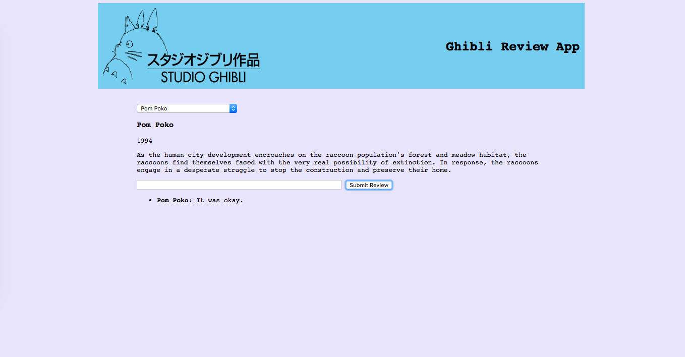

# Movie App

Create an app using the [Studio Ghibli API](https://ghibliapi.herokuapp.com/#) that allows users to view and review each movie.

This app should have (in order of placement in the HTML):

- An image of the [Studio Ghibli logo](https://upload.wikimedia.org/wikipedia/en/thumb/c/ca/Studio_Ghibli_logo.svg/1200px-Studio_Ghibli_logo.svg.png)
- A header (`h1`) that reads "Ghibli Review App"
- A `select` box that contains the title of each movie available in the API, as well as a default blank selection
- A `div`, empty at first, that will contain the title (`h3`), release year (`p`), and description (`p`) of the selected film.
- A `form`, including a "text" `input` and a "submit" `input`, that allows users to submit (not save, just add to the frontend) a review of that film.
- A `ul` underneath that `form` that should contain the submitted reviews of each film.

Please feel free to include additional `div`s and elements if they make styling the application easier.

The user should be able to:

- Use the `select` box to select a specific film. When they select a film, information about that film (title, release year, description) should populate in the `div` below. When they select a different film, this information should be replaced.
- Use the `form`, below the movie information, to submit a review. Each review should be a new `li`, with the selected film's title (in bold) and a review body (not bold).

## Styling

Assume default styling unless explicitly articulated here. **Do not** utilize CSS Reset.

Your website should be responsive and work on screens of different sizes.

- **Body**
  - Monospace font for all text (inputs excepted - default is fine).
  - `lavender` background color.
  - Arrange content in a column, centered on the page width-wise.
- **Header**
  - Header should contain the `image` and `h1` tags.
  - Width: 70 percent. Height: 150px.
  - Image and header text should be horizontally oriented.
  - Image and header text should be on opposite sides of the header. Vertically, they should both be positioned in the center of their containing `div`.
  - Image should have the same height as the header (150px).
  - Header should have a margin of 30 pixels on the bottom and a padding of 10 pixels on all sides.
  - Header background color should be `skyblue`.
- **Main Area**
  - Main area should contain all other content on the page.
  - Width: 60 percent.
  - Content should be oriented in a column, justified left.
- **Review Text Input**
  - The `text` input should have an explicit `width` of 400 pixels.

Your app should end up looking something like this:

## Rubric

HTML
1. Image of studio Ghibli logo
2. Header (h1) that says "Ghibli Review App"
3. (Select) box that contains the titles of each movie availible in the API as well as a default blank section
4. An empty (div) that will hold an (h3) title tag, release year (p) and description (p)
    * When users -select- an option, the div will be populated/ replaced with information 
5. A (form) that includes a (text) input and a (submit) input that allows users not only to submit their review to the page
    6. A (ul) under the form that will list (li) all reviews submitted by users
    7. Film title in bold and review not bold.

CSS
** Body **
    1. Monospace font
    2. "Lavender" background
    3. In a column centered on the page width wise
** Header **
    1. Header should contain (image) and h1) tags
    2. Width is 70% and height 150 px
    3. Image and header text should be horizontally oriented
    4. Totoro and title should be on opposite sides of each other with *center* positioning in relation to the height
    5. Totoro image should be the same height as the header (150px)
    6. Header should have 30px margin on the bottom and padding of 10px on all sides
    7. Header background should be (skyblue)
** Main Area **
    1. Contains all other content (select/ description div/ form/ reviews)
    2. Width should be 60%
    3. Content should be in a (column) with a (left orientation)
** Review Text Input ** 
    1. Text(input) should have an explicit width of 400 px
    